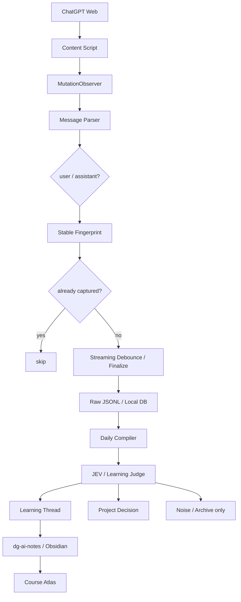

# 2026-09-22 学习笔记：ChatGPT 网页采集与 Course Learning 自动整理

> 今天真正打通的问题不是“怎么让模型每天总结聊天”，而是：**怎样把 ChatGPT Web 上真实发生的问答可靠采集成证据，再让 JEV / Learning Judge 把证据整理成可复习的 Course Learning。**
>
> 这条线的关键分界是：**聊天历史引用 ≠ 完整 transcript；采集 ≠ 总结；写了笔记 ≠ 已经掌握。**
>
> 说明：本次自动日结尝试检索 2026-09-22 当天的历史会话，但会话检索接口未返回结果。因此本文只沉淀当前可见对话与已能确认的近期项目上下文，不把它冒充成“当天全部聊天的完整备份”。

---

## 1. 现象：为什么只靠 ChatGPT 的“历史引用”做每日学习日结不够？

今天最初想要的是：

```text
每天
↓
读取我今天在 ChatGPT Web 问过的所有问题和回答
↓
自动筛选学习内容
↓
写入 Course Learning
```

容易产生的误解是：既然 ChatGPT 能引用过去对话，就等于它能像数据库一样枚举左侧栏所有 conversation，再逐个读取完整 transcript。

实际上这两件事不同：

```text
历史引用
= 为当前回答召回相关历史信息

完整归档
= 枚举 conversation
+ 读取每一条 user / assistant message
+ 保证顺序、完整性和不漏项
```

所以如果目标是“知识回顾”，历史引用可以作为补充；如果目标是“一个问题都不漏”，必须有独立的采集层。

---

# 2. 最小实验：先证明网页消息能可靠落成 Raw Event

不要一上来做“每天爬整个 Recents”。

第一版只验证一个会话：

```text
ChatGPT Web 打开一个 conversation
        ↓
用户发送 Q1
        ↓
页面出现 user message
        ↓
Collector 捕获
        ↓
GPT 流式生成 A1
        ↓
结束后捕获最终 assistant message
        ↓
写入本地 JSONL
```

期望 Raw Store：

```jsonl
{"conversation_id":"...","role":"user","content":"Q1","captured_at":"..."}
{"conversation_id":"...","role":"assistant","content":"A1","captured_at":"..."}
```

第一轮实验只验四件事：

1. Q/A 顺序正确；
2. assistant 流式输出只留下最终版本；
3. 页面 rerender 不产生重复消息；
4. 刷新 / 切回 conversation 后不会再次写入相同消息。

如果这四项没过，先不要接 LLM 总结。

---

# 3. 心智模型：Raw Conversation 和 Derived Knowledge 必须分层

今天最重要的系统边界：

```text
┌──────────────────────────────┐
│ Raw Conversation Evidence    │
│                              │
│ 真实问题                     │
│ 真实回答                     │
│ conversation_id / 时间 / 顺序 │
│ append-only                  │
└──────────────┬───────────────┘
               │
               ▼
┌──────────────────────────────┐
│ Learning Judge / JEV         │
│                              │
│ 学习？项目决策？求职？噪声？ │
│ 是否与已有知识重复？          │
│ 是否需要进入复习？            │
└──────────────┬───────────────┘
               │
               ▼
┌──────────────────────────────┐
│ Derived Knowledge            │
│                              │
│ Knowledge Thread / Atom      │
│ 误区 / 心智模型 / 复习题      │
│ 可以修订、合并、纠错          │
└──────────────────────────────┘
```

因此：

> **Raw 是证据层；Course Learning 是知识层。**

即使 GPT 当时答错了，也不应该改写 Raw；应该在知识层记录：

```text
原回答：X
后续实验：X 不成立
当前知识：Y
```

这和 Memory 设计里的 `evidence → atom → consolidated knowledge` 是同一个思想。

---

# 4. 为什么实时事件采集优于“每天晚上爬左侧聊天列表”？

方案 A：每天晚上批量打开历史聊天。

```text
23:00
↓
打开 Recents
↓
滚动虚拟列表
↓
逐个 conversation
↓
等待消息加载
↓
解析 DOM
```

问题很多：

- 左侧列表可能虚拟化，未滚动的会话没加载；
- UI / DOM 结构一改，selector 就失效；
- 大量会话逐个加载慢；
- 网络波动时容易漏；
- 很难区分“读取失败”和“今天没有内容”。

方案 B：聊天发生时实时采集。

```text
message 出现在页面
↓
MutationObserver 收到 DOM 变化
↓
解析消息
↓
生成稳定 fingerprint
↓
去重
↓
append Raw Event
```

核心差异：

> **事件驱动是在事实发生时记录事实；批处理爬虫是在事后试图恢复事实。**

对学习系统来说，前者更可靠。

---

# 5. ChatGPT Web Collector 的完整数据流



这里浏览器 Extension 只是 Sensor，不负责做总结。

它应该尽量只产生：

```text
conversation_id
message_id / fingerprint
role
content
captured_at
url
optional title
```

语义判断放在后面的 Learning Judge。

---

# 6. 流式输出为什么必须单独处理？

GPT 的 assistant DOM 会经历：

```text
A
↓
Agent
↓
Agent 的
↓
Agent 的上下文
↓
Agent 的上下文管理……
```

如果每次 MutationObserver 触发都 append：

```text
A
Agent
Agent 的
Agent 的上下文
...
```

Raw Store 就被污染了。

更合理：

```text
assistant starts streaming
        ↓
不断覆盖 temporary buffer
        ↓
一段时间无变化 / 页面出现完成态
        ↓
debounce
        ↓
只提交最终文本
```

所以这里要区分：

```text
DOM mutation event
≠
new logical message
```

这和 Agent Runtime 里 `delta event` 与 `final message` 的区别非常像。

---

# 7. Conversation ID、消息 ID 与去重

当前 ChatGPT conversation URL 通常包含 conversation 标识，因此 URL 可以作为一个可观察来源；但 Collector 不应只依赖 title。

去重至少需要：

```text
conversation_id
+
role
+
logical message identity
```

如果页面没有稳定 message id，可以退化成 fingerprint，例如：

```text
hash(conversation_id + role + normalized_content + position)
```

但纯内容 hash 有风险：

```text
用户连续两次发送“继续”
```

文本完全相同，却是两条不同消息。

因此更好的优先级：

```text
官方稳定 DOM id（若存在）
>
conversation 内消息顺序 + role
>
内容 fingerprint 兜底
```

---

# 8. JEV 在这条管线里应该做什么？

JEV 不应该拥有 Raw，也不应该直接“凭感觉写一篇总结”。

适合它的是有限决策：

```text
这段讨论属于 learning 吗？
→ yes / no / uncertain

它更像哪类？
→ agent-runtime
→ rag
→ memory
→ gis
→ backend
→ career
→ other

是否与已有 Knowledge Thread 重复？
→ thread A / thread B / new

是否需要进入复习队列？
→ yes / no
```

这与现有 Jev 学习笔记中的分工一致：

```text
Code
→ deterministic rules

Jev
→ finite semantic decisions

LLM
→ explanation / synthesis / generation
```

因此 Daily Compiler 更合理的结构是：

```text
Code：恢复对话边界、去重、时间筛选
↓
Jev：分类 / routing / merge candidate / review gate
↓
LLM：把已经选中的学习 thread 写成教材式笔记
```

而不是：

```text
把一天所有聊天一次性塞给 LLM
↓
“请总结”
```

---

# 9. 从聊天到 Course Learning：不要一问一笔记

例如连续追问：

```text
Q1 Session 和 Room 有什么区别？
Q2 那断线以后恢复哪个？
Q3 JEV 应该在哪一层？
Q4 长时间搁置以后怎么办？
```

这些不应该生成四篇文章。

应该先聚成：

```text
Knowledge Thread
Agent Context Lifecycle

├── initial question
├── follow-up
├── misconception
├── refined model
├── project evidence
└── unresolved question
```

Course Atlas 要展示的是知识结构，而不是聊天数量。

---

# 10. authoring_progress 和 learning_progress 必须分开

这是今天必须保留的规则。

```text
authoring_progress
= 笔记有没有被整理、写入、索引

learning_progress
= 用户能不能独立解释、复现、验证
```

今天可以明确记录：

```yaml
authoring_progress:
  status: captured
  note_written: true
  indexed_for_course_learning: true

learning_progress:
  status: unassessed
  evidence: none
  reason: 尚未进行脱稿复述或最小实现实验
```

**不能因为自动化把文档写出来，就把掌握度加分。**

---

# 11. 失败模式：第一版实现时必须主动测

## 11.1 Streaming duplication

现象：同一 assistant 回答被保存几十次。

验证：让模型输出 500+ 字，检查 Raw Store 最终只有一条 assistant final message。

## 11.2 SPA route change

现象：ChatGPT 切换 conversation 不刷新页面，旧 observer 仍在或新页面没重新绑定。

验证：A → B → A 来回切换，检查 conversation_id 与消息归属。

## 11.3 Virtualized DOM

现象：历史消息离开 viewport 后 DOM 被回收，之后重新出现导致重复采集。

验证：长会话滚动上下，再检查 dedup。

## 11.4 DOM selector drift

现象：ChatGPT 前端改 class，parser 全失效。

策略：优先语义属性 / role 特征，parser 加版本与健康检查，不把 CSS class 当永久协议。

## 11.5 Collector endpoint unavailable

现象：PAW 本地 ingest 服务没启动。

策略：Extension 先写 `chrome.storage` / IndexedDB outbox，服务恢复后重放；不能直接丢事件。

## 11.6 Summary hallucination

现象：Daily Compiler 把没有出现过的结论写进学习笔记。

策略：Derived Knowledge 必须保留 source conversation / message refs；重要结论允许回溯 Raw Evidence。

---

# 12. 与现有课程 / 项目的连接

## PAW

这条线可以成为 PAW 的一个输入源：

```text
ChatGPT Web
↓
Collector
↓
PAW Ingest
↓
JEV Routing
↓
Memory / Project / Learning
```

设计目标文件（**目前是计划锚点，不代表仓库已经存在这些文件**）：

```text
apps/chatgpt-collector/
packages/ingest/chatgpt.ts
packages/learning/judge.ts
packages/learning/compiler.ts
```

## Agent / Pi 课程

可直接复习现有：

```text
pi-agent/docs/typescript/第6章-消息系统-Agent的记忆如何组织与传递.md
pi-agent/docs/typescript/第7章-事件驱动-Agent的神经系统.md
pi-agent/docs/typescript/第8章-上下文工程-让有限窗口装下无限对话.md
pi-agent/docs/typescript/第10章-会话管理-对话的存储恢复与分叉.md
```

今天的 Collector 本质上把这些课程概念落到了真实网页事件管线：

```text
事件
→ 消息
→ 会话
→ 持久化
→ 恢复
→ 上下文选择
```

## Memory

对应：

```text
Raw Conversation = evidence
Knowledge Thread = atom / consolidated knowledge
```

## JEV

JEV 最适合：分类、路由、合并候选、是否值得复习；不适合替代 Raw Store，也不适合承担所有自由生成。

## Course Atlas

Course Atlas 只消费整理后的学习资产与复习状态，不承担聊天采集。

---

# 13. 下一步最小落地顺序

不要先做整套产品，按四步验证：

```text
Step 1
一个 conversation
→ 捕获 user + assistant final
→ JSONL

Step 2
处理 streaming + rerender + route switch
→ 保证不重不漏

Step 3
一天 Raw Event
→ group conversation
→ classify learning/project/noise

Step 4
learning thread
→ 写 dg-ai-notes
→ Course Atlas 索引
→ 生成复习题
```

只有 Step 1/2 稳定以后，才值得接模型。

---

# 14. 今日复习题

### Q1. 为什么“ChatGPT 能引用过去对话”不能推出“它能完整枚举当天所有聊天”？

检查点：语义召回和 transcript enumeration 的目标与完整性保证不同。

### Q2. 为什么网页采集应该优先事件驱动，而不是每天晚上批量爬 Recents？

检查点：事实发生时记录 vs 事后恢复；虚拟列表、网络、DOM 变化和漏项风险。

### Q3. GPT 流式输出为什么不能把每次 DOM mutation 都当成新消息？

检查点：delta event ≠ logical final message；需要 buffer + finalize/debounce。

### Q4. 为什么 Raw Conversation 和 Course Learning 不能放在同一个可覆写文档里？

检查点：Raw 是证据，应 append-only；知识可以纠错和合并。

### Q5. JEV 在这条系统里最适合负责哪类任务？为什么？

检查点：有限答案空间里的语义分类/路由，而不是完整 transcript 持久化或开放式教材生成。

---

# 15. 今日状态

```yaml
authoring_progress:
  note_written: true
  source_repository: 7155/dg-ai-notes
  status: captured

learning_progress:
  status: unassessed
  verified_by_recall: false
  verified_by_code_experiment: false
  next_evidence:
    - 独立画出 Collector → Raw → Judge → Course Atlas 数据流
    - 实现一个最小 MutationObserver 采集实验并通过去重/流式测试
```

一句话收束：

> **要自动整理 ChatGPT 学习记录，最可靠的起点不是让模型“回忆今天聊了什么”，而是在聊天发生时把消息作为事件保存；之后再用代码、JEV 和生成式 LLM 分工完成分类、合并、教材化与复习。**
