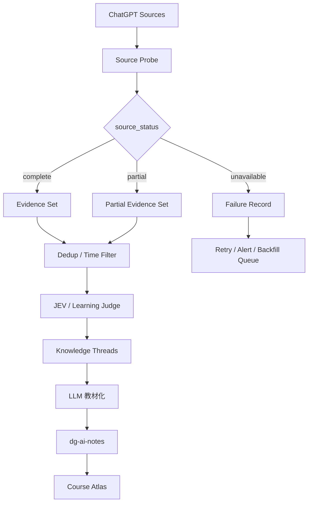

# 2026-09-23 学习笔记：ChatGPT 日结的证据门禁与失败恢复

> 今日没有拿到可验证的 2026-09-23 ChatGPT 历史对话 transcript。历史会话检索连续返回错误，因此**不能把“检索失败”当成“今天没有学习内容”**，也不能从旧笔记或近期项目记忆反推今天发生过的聊天。
>
> 今天真正值得沉淀的是一条自动学习流水线的工程规则：**先证明证据可用，再允许知识生成；source unavailable 与 zero result 必须是两个状态。**
>
> 本文是“自动化流水线失败观察”产生的工程学习记录，不冒充用户今天真实聊天内容的完整摘要。

---

## 1. 现象：为什么“没有搜到聊天”不能直接生成空日结？

每日 Course Learning 的目标是：

```text
当天 ChatGPT 对话
↓
筛出学习 / 项目能力提升内容
↓
形成知识 thread
↓
写入 dg-ai-notes
↓
Course Atlas 同步
```

但上游历史检索失败时，会出现两个表面相似、语义完全不同的情况：

```text
A. source_status = complete
   items = []
   → 今天确实没有可沉淀内容

B. source_status = unavailable
   items = unknown
   → 不知道今天有没有内容
```

如果把 B 当成 A，就会产生“假阴性”：系统告诉用户“今天没有学习”，实际上只是采集器坏了。

因此每日学习编译器必须先判断**证据可用性**，再做语义整理。

---

## 2. 最小实验：给 Daily Compiler 增加 Source Envelope

不要先扩展总结 Prompt。先给输入增加明确的状态协议：

```ts
type SourceStatus = "complete" | "partial" | "unavailable";

type EvidenceRef = {
  source: "chatgpt-web" | "chat-history" | "import";
  conversationId?: string;
  messageId?: string;
  capturedAt?: string;
};

type DailyEvidenceEnvelope = {
  date: string;
  status: SourceStatus;
  items: EvidenceRef[];
  errors: string[];
  collectedAt: string;
};
```

最小行为：

```text
complete + 0 items
→ 允许生成“今日无学习内容”

complete/partial + items > 0
→ 进入分类、聚类、教材化

unavailable
→ 禁止生成“今日知识结论”
→ 只记录 source failure
→ learning_progress 不变
```

这比在 Prompt 里写“不要幻觉”更可靠，因为它把正确性变成了**运行时门禁**。

---

## 3. 心智模型：数据管线先判断 Evidence，再判断 Meaning



核心顺序：

```text
Availability
↓
Integrity
↓
Semantics
↓
Synthesis
↓
Learning State
```

不能倒过来。

---

## 4. 因果逻辑：为什么这个问题本质上是“可观测性”，不是“总结能力”？

如果没有 Raw Evidence，LLM 再强也只能做两件事：

1. 从旧上下文猜今天发生过什么；
2. 把近期项目状态误写成今天的学习记录。

两者都会破坏学习时间线。

因此系统必须保存：

```text
source status
source timestamp
conversation/message refs
coverage boundary
failure reason
```

这和后端数据系统里的 watermark / checkpoint / ingestion health 是同一个问题。

每日学习系统不是“每天跑一个总结 Prompt”，而是一条需要：

```text
采集完整性
+ 去重
+ provenance
+ retry
+ idempotency
+ semantic processing
```

的数据管线。

---

## 5. 与昨天 ChatGPT Web Collector 设计的连接

昨天已经确定：

```text
ChatGPT Web
↓
Collector
↓
Raw Conversation Evidence
↓
Code 清洗
↓
JEV 分类
↓
LLM 教材化
↓
Course Learning
```

今天补上的关键层是：

```text
Collector / History Source
↓
Source Health + Coverage Gate   ← 今天新增的工程认识
↓
Raw Evidence
```

也就是说，只有 Collector 还不够；还要知道 Collector **有没有工作、覆盖到哪里、是否漏了时间段**。

已有真实文档锚点：

```text
7155/dg-ai-notes
pi-agent/docs/typescript/学习笔记-2026-09-22-ChatGPT网页采集与Course-Learning自动整理.md

7155/course-learning
notes/2026-09-22-chatgpt-web-learning-pipeline.md
```

计划中的实现锚点（仅为设计目标，不代表仓库已存在）：

```text
apps/chatgpt-collector/
packages/ingest/chatgpt.ts
packages/learning/compiler.ts
```

---

## 6. 一个更成熟的 Daily Compiler 状态机

```text
START
  ↓
probe sources
  ↓
┌─────────────────────────────┐
│ complete                    │
│ partial                     │
│ unavailable                 │
└─────────────────────────────┘
  │             │            │
  │             │            └→ record failure
  │             │               enqueue backfill
  │             │               stop semantic write
  │             ↓
  │        mark coverage gap
  │             ↓
  └──────→ normalize evidence
                ↓
             dedup
                ↓
          cluster threads
                ↓
           JEV classify
                ↓
          synthesize notes
                ↓
          write + index
                ↓
       authoring_progress only
```

这里最重要的是最后一行：

```text
自动写笔记
≠
用户已掌握
```

因此即使未来 source 完整、日结正常生成：

```yaml
authoring_progress:
  status: captured

learning_progress:
  status: unassessed
```

仍然应该分开。

---

## 7. 失败模式

### 7.1 Retrieval failure 被误判成 zero result

后果：生成假的“今日无学习”。

解决：`status` 与 `items.length` 分离。

### 7.2 Partial coverage 被标成 complete

例如只抓到了 08:00–12:00，却总结成全天。

解决：记录 coverage：

```text
from
until
source cursor / watermark
```

### 7.3 重试后重复写入

第一次部分成功，第二次 backfill 又把相同 conversation 写一遍。

解决：Raw Event 必须有稳定 identity，写入幂等。

### 7.4 无 provenance 的教材化

笔记里的结论无法回到对应问答。

解决：Knowledge Thread 保存 source refs；关键结论至少能定位 conversation/message。

### 7.5 自动化失败却提升 mastery

这是最严重的学习状态污染之一。

解决：只有主动回忆、代码实验、题目验证等 evidence 才能修改 `learning_progress`。

---

## 8. 今天容易混淆的点

### 混淆 1：搜索结果为空 = 今天没有聊天

错。

```text
empty result
```

只有在 `source_status = complete` 时才代表“确实为空”。

### 混淆 2：LLM 能补历史上下文 = 可以补采集缺口

错。

历史语义记忆可以帮助理解，但不能作为完整 transcript 的替代证据。

### 混淆 3：失败时生成一篇“近况总结”也没关系

对学习系统不合适。它会把时间和来源污染掉。

更好的行为是明确：

```text
source unavailable
→ 不生成当天知识事实
→ 等待 backfill
```

---

## 9. 与 PAW / Agent / RAG / Memory / 后端的关联

### PAW

PAW 的多个输入源最终都需要同一个 `SourceEnvelope` 思想：聊天、IME、语音、项目文档都不能只传 content，还要传 coverage / provenance / health。

### Agent

这是 Agent Runtime 的可靠性问题：工具调用失败不是“工具返回空结果”。模型必须能区分 `success([])` 与 `error`。

### RAG

RAG 也一样：

```text
retrieval returned 0 docs
```

和：

```text
vector store unavailable
```

不能合并成同一个状态。

### Memory

Memory 的 evidence 层必须保存来源。如果 evidence 缺失，就不能把推断直接升级成稳定 memory atom。

### 后端

对应经典的数据工程概念：

- idempotency
- watermark
- checkpoint
- retry / backoff
- dead-letter / backfill queue
- observability
- provenance

这说明个人学习系统本质上也是一个小型事件数据平台。

---

## 10. 复习题

1. 为什么 `source_status = unavailable, items = []` 不能解释成“今天没有学习内容”？
2. Daily Compiler 为什么应该在 JEV / LLM 之前增加 Evidence Gate？
3. `complete / partial / unavailable` 三种状态分别允许哪些下游行为？
4. 为什么自动生成了学习笔记仍不能提升 `learning_progress`？
5. ChatGPT 日结里的 coverage watermark 与后端数据管线的 checkpoint 有什么共同点？

---

## 11. 下一步最小实现

优先完成一个非常小的可靠性闭环：

```text
1. Collector/Source 返回 SourceEnvelope
2. Daily Compiler 拒绝 unavailable 输入
3. partial 输入必须把 coverage gap 写入元数据
4. Raw Event 使用稳定 event_id 幂等写入
5. backfill 成功后重新编译当天笔记
6. 只有新的 evidence 到达时才更新 authoring_progress
7. learning_progress 完全不由日结自动任务修改
```

建议第一组测试：

```text
T1 complete + 0 events
T2 complete + 10 events
T3 partial + 5 events
T4 unavailable
T5 partial → retry → complete
T6 同一批 events 重放两次
```

通过这 6 个测试后，再做更复杂的知识聚类。

---

## 12. 今日状态

```yaml
date: 2026-09-23
source_scope: chat_history_retrieval_unavailable
verified_chat_threads: 0
source_observation:
  chat_history_search: failed
  repeated_attempts: true
  interpretation: unknown_not_empty
authoring_progress:
  status: captured
  detailed_note_written: true
  topic: source-integrity-and-failure-recovery
learning_progress:
  status: unassessed
  verified_by_recall: false
  verified_by_code_experiment: false
next_learning_evidence:
  - 实现 SourceEnvelope 类型
  - 写 complete / partial / unavailable 三状态测试
  - 实现 partial → backfill → complete 的幂等重放测试
```
