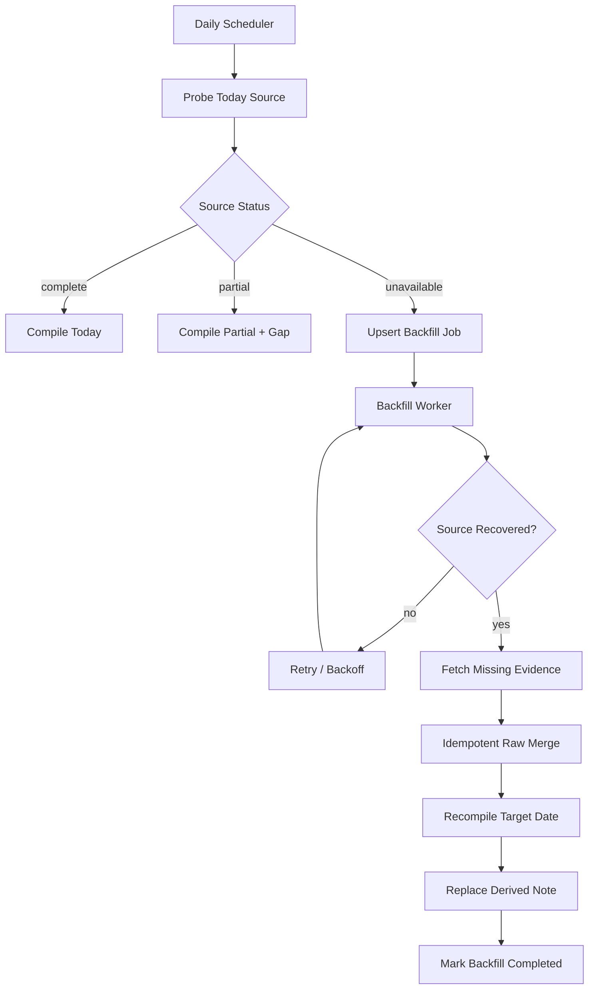

# 2026-09-24 学习笔记：ChatGPT 日结的 Deferred Backfill 与幂等重编译

> 今日主动检索 2026-09-24 的 ChatGPT 历史会话时，历史会话检索连续失败，未返回可验证 transcript。这里不把“检索失败”冒充成“今天没有学习内容”，也不从旧记忆反推今天发生过的聊天。
>
> 相比 2026-09-23 只建立 `complete / partial / unavailable` 的 Evidence Gate，今天新增的工程问题是：**如果 source 连续两天 unavailable，Daily Compiler 不能每天只写一条失败日志；它需要一个可恢复、可幂等执行的 Deferred Backfill 队列。**

---

## 1. 现象：Evidence Gate 只能阻止错误写入，还不能完成恢复

昨天已经确定：

```text
source probe
↓
complete / partial / unavailable
↓
Evidence Gate
↓
只有存在可靠 evidence 才允许做语义整理
```

这能解决“把失败当空结果”的问题，但如果数据源连续不可用：

```text
2026-09-23 unavailable
2026-09-24 unavailable
```

仅仅每天记录：

```text
source unavailable
```

并不能保证以后补回 9 月 23 日、24 日的真实聊天。

因此系统还缺一个状态：

```text
待补采日期
```

也就是 Deferred Backfill。

---

## 2. 最小实验：把失败日期变成持久化 Backfill Job

不要依赖“明天的任务记得昨天失败过”。失败状态必须持久化。

```ts
type BackfillStatus =
  | "pending"
  | "running"
  | "blocked"
  | "completed";

type BackfillJob = {
  source: "chat-history" | "chatgpt-web" | "import";
  date: string;
  status: BackfillStatus;
  attempts: number;
  lastError?: string;
  nextRetryAt?: string;
  lastEvidenceCursor?: string;
};
```

当 Source Probe 返回 `unavailable`：

```ts
if (envelope.status === "unavailable") {
  await backfillQueue.upsert({
    source: "chat-history",
    date: envelope.date,
    status: "pending",
  });

  return {
    semanticWrite: false,
    learningProgressWrite: false,
  };
}
```

关键是 `upsert`，不是 append。

同一天连续失败 10 次，仍应只有一个 Backfill Job。

---

## 3. 心智模型：Daily Run 与 Historical Repair 是两条不同流水线



两条职责要分开：

```text
Daily Run
= 今天有没有新 evidence？

Backfill Worker
= 过去缺失的 evidence 能不能补回来？
```

如果把它们混在一起，就会出现：

- 今天任务失败后，昨天永远没人再管；
- 补采时重复写入；
- 晚到 evidence 到达后，旧的“不完整日结”仍留在索引里；
- authoring 状态和 learning 状态一起被错误覆盖。

---

## 4. 完整调用链：从 Source Failure 到 Late Evidence 修复

```text
09:00 Daily Compiler
↓
probe(2026-09-24)
↓
unavailable
↓
Evidence Gate 阻止语义写入
↓
backfill_queue.upsert(2026-09-24)
↓
任务结束

之后 source 恢复
↓
Backfill Worker 领取 2026-09-24
↓
fetch raw transcript
↓
normalize
↓
stable event_id 去重
↓
merge raw store
↓
compile(date=2026-09-24)
↓
重新生成 Derived Knowledge
↓
更新 Course Learning 索引
↓
BackfillJob = completed
```

这里的核心不是“重跑一次 Prompt”，而是**重新执行一条可重放的数据流水线**。

---

## 5. 为什么必须幂等？

假设第一次 Backfill 拉到了 50 条消息，但写到第 30 条时中断。

第二次重试如果直接 append：

```text
message 1..30
+
message 1..50
```

就会重复。

因此 Raw Event 要有稳定身份：

```ts
type RawChatEvent = {
  eventId: string; // stable
  conversationId: string;
  messageId: string;
  role: "user" | "assistant";
  content: string;
  sourceCreatedAt: string;
};
```

推荐优先使用源系统稳定 ID：

```text
event_id = source + conversation_id + message_id
```

如果源没有 message id，才退化到 canonical content hash：

```text
conversation_id
+ role
+ normalized_content
+ source_timestamp_bucket
```

注意：hash 是 fallback，不应优先于真实 source identity。

---

## 6. 晚到 Evidence 到达后，为什么应该“重编译 Derived”，而不是 patch 文本？

Course Learning 里的日结属于 Derived View。

```text
Raw Evidence
= source of truth

Daily Learning Note
= materialized view
```

如果 9 月 24 日早上只拿到 partial evidence，晚上 backfill 得到完整 transcript，正确做法是：

```text
重新从完整 evidence 编译 9 月 24 日
```

而不是让 LLM 对旧 Markdown 做：

```text
“帮我补充缺失内容”
```

原因：patch 文本很难保证：

- 重复主题正确合并；
- 旧错误结论被删除；
- 问题顺序恢复正确；
- source refs 一致；
- authoring 元数据正确更新。

因此：

```text
Raw append / merge
Derived replace
```

通常比：

```text
Derived incremental patch
```

更可靠。

---

## 7. Retry 策略：不要把 transient error 变成无限重试

Backfill Worker 需要 retry policy：

```ts
type RetryPolicy = {
  maxAttempts: number;
  baseDelayMs: number;
  maxDelayMs: number;
  jitter: boolean;
};
```

例如：

```text
attempt 1 → 5 min
attempt 2 → 15 min
attempt 3 → 1 h
attempt 4 → 6 h
attempt 5 → 24 h
```

超过 retry budget 后：

```text
pending
→ blocked
```

但 `blocked` 仍然不能等价为“无数据”。

它表示：

```text
我们仍知道这里存在 coverage gap，
只是自动恢复暂时停止。
```

---

## 8. Course Learning 状态应该怎么变化？

这次最重要的边界仍然是：

```text
authoring_progress
≠
learning_progress
```

建议：

```yaml
authoring_progress:
  status: source_blocked
  source_complete: false
  pending_backfill: true

learning_progress:
  status: unassessed
```

Backfill 完成后：

```yaml
authoring_progress:
  status: captured
  source_complete: true
  pending_backfill: false

learning_progress:
  status: unassessed
```

即使完整笔记自动生成成功，`learning_progress` 也不应该自动提高。

只有以下 evidence 才能提升学习状态：

- 用户独立复述；
- 代码实验成功；
- 复习题答对；
- 在新问题中正确迁移使用。

---

## 9. 本次自动化容易混淆的点

### 9.1 “昨天已经记录失败，今天继续失败就不用管了”

错。

连续失败意味着系统必须保存**跨日未完成工作**，而不是产生更多相似日志。

### 9.2 “重试成功后 append 一份新日结即可”

不够。

同一天应该有一个最终 Derived View；晚到 evidence 后应重编译并替换 derived note，而不是产生多个互相冲突的“9 月 24 日总结”。

### 9.3 “Backfill 成功 = 学会了”

错。

Backfill 只修复数据完整性，属于 authoring / ingestion 层。

### 9.4 “失败日期存在于日志里，未来就能恢复”

不一定。

必须有机器可读的 queue/state，而不是只写自然语言日志。

---

## 10. 与 PAW / Agent / RAG / Memory / 后端的关联

### PAW

PAW 的 IME、ChatGPT Web、语音、项目文档等输入都可以统一成：

```text
SourceEnvelope
+
BackfillJob
+
Raw Event Store
+
Derived Views
```

这让“输入源偶发掉线”不再直接污染 Memory 与 Knowledge。

### Agent Runtime

Agent Tool 的失败恢复也是同一模型：

```text
attempt
↓
transient error
↓
retry/backoff
↓
resume from durable state
```

不能只把错误字符串放进上下文然后期待模型“下次记住”。

### RAG

索引更新失败后，同样需要记录：

```text
which corpus
which range/version
which embeddings missing
which backfill pending
```

否则检索结果“看起来正常”但实际覆盖不完整。

### Memory

Memory consolidation 如果上游 evidence coverage 不完整，应标记：

```text
provisional / incomplete
```

而不是把缺失期的推断提升成稳定 memory atom。

### 后端

对应的工程概念包括：

- durable queue
- retry budget
- exponential backoff
- idempotency key
- materialized view rebuild
- event replay
- watermark / checkpoint
- dead-letter / blocked state
- observability

这也是为什么个人学习系统最终会越来越像一个小型 event-driven backend。

---

## 11. 真实项目 / 文档锚点

已存在并可验证：

```text
7155/dg-ai-notes
pi-agent/docs/typescript/学习笔记-2026-09-23-ChatGPT日结的证据门禁与失败恢复.md

7155/course-learning
notes/2026-09-23-chatgpt-daily-source-integrity.md

7155/course-learning
notes/2026-09-22-chatgpt-web-learning-pipeline.md
```

今天建议新增的实现锚点仍属于设计目标，不冒充已实现代码：

```text
packages/learning/source-envelope.ts
packages/learning/backfill-queue.ts
packages/learning/compiler.ts
packages/learning/raw-event-store.ts
```

---

## 12. 最小测试集

先不用上真实 LLM，总共做 8 个确定性测试：

```text
T1 unavailable → 创建 pending BackfillJob
T2 同一天再次 unavailable → upsert，不新增重复 job
T3 pending → source recovered → running
T4 backfill 中途失败 → retry，不重复 Raw Event
T5 repeated raw batch → event_id 幂等
T6 partial → complete → derived note 重编译
T7 backfill complete → authoring_progress captured
T8 backfill complete → learning_progress 仍 unassessed
```

通过后再加入：

```text
JEV classification
Topic clustering
LLM synthesis
Review-question generation
```

确定性可靠性放在语义智能之前。

---

## 13. 复习题

1. Evidence Gate 和 Backfill Queue 分别解决什么问题？为什么二者不能互相替代？
2. 为什么同一天连续失败多次应该 `upsert BackfillJob`，而不是 append 多条失败记录？
3. 为什么晚到 evidence 更适合触发“重编译 Derived View”，而不是让 LLM patch 旧 Markdown？
4. Raw Event 的稳定 `event_id` 为什么是 Backfill 幂等性的基础？
5. `blocked` 状态为什么不能解释成“该日期没有学习数据”？

---

## 14. 下一步

优先做一个不用模型的可靠性闭环：

```text
SourceEnvelope
↓
Evidence Gate
↓
unavailable
↓
BackfillQueue.upsert(date)
↓
Source 恢复
↓
Idempotent Raw Merge
↓
Recompile(date)
↓
Replace Derived View
```

实现顺序建议：

```text
1. SourceEnvelope
2. BackfillJob schema
3. durable queue
4. stable event_id
5. compile(date) 做成纯函数式入口
6. replace derived output
7. 8 组测试
8. 最后接 JEV / LLM
```

---

## 15. 今日状态

```yaml
date: 2026-09-24
source_scope: chat_history_retrieval_unavailable
verified_chat_threads: 0
source_observation:
  chat_history_search: failed
  repeated_attempts_today: true
  previous_day_also_failed: true
  interpretation: unknown_not_empty
authoring_progress:
  status: captured
  detailed_note_written: true
  topic: deferred-backfill-and-idempotent-recompile
  source_complete: false
  pending_backfill: true
learning_progress:
  status: unassessed
  verified_by_recall: false
  verified_by_code_experiment: false
next_learning_evidence:
  - 实现 BackfillJob durable state
  - 验证同一天重复失败只保留一个 pending job
  - 验证 partial -> complete 后 Derived View 重编译
  - 验证 backfill 不会改变 learning_progress
```

> 这份记录不是“2026-09-24 全部 ChatGPT 学习对话总结”。由于历史会话源不可用，今天没有可验证的 transcript 可供逐主题整理；本文只沉淀本次自动化运行本身产生的可验证工程认识。